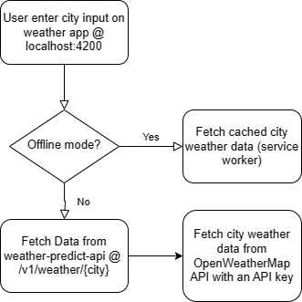

## Requirement 
This project is created as per the requirements of the assignment provided by publicis sapient.
1. List of temperatures along with date
2. Prediction along with the time window

## Design Principles :
This app has been developed using 12 Factor app methodology. More info about 12 Factor app methodology here : https://en.wikipedia.org/wiki/Twelve-Factor_App_methodology

## Design Patterns :
This app uses proxy design pattern to redirect to cached backend responses for offline mode using pwa service worker. 

## WeatherAppService

This project was generated with [Angular CLI](https://github.com/angular/angular-cli) version 16.2.1.

## Installation

This project is angular-based. So It requires node 16 (or later) and npm to run.

```sh
$ cd weather-app-service
$ npm install
$ ng serve
```

Or if there is need to build new image then it can also be build and pushed to
docker hub via

```sh
$ cd weather-app-service
$ docker build -t rjpraj/weather-app-angular:latest .
$ docker push rjpraj/weather-app-angular:latest 

And then run to start application
```sh
$ docker run -p 4200:4200 docker.io/rjpraj/weather-app-angular:latest 
```

## Test weather app

As required, this app has 1 user input :
1. city

Running angular application can be accessed at  :
http://localhost:4200

## Dependency

This angular app needs a docker rest api container running on the host machine, accessible at :
http://host.docker.internal:8080/v1/weather/${city}

## Offline mode 

The app supports offline mode, and can be accessed in offline mode by switing to Offline from Application --> ServiceWorker in dev tools.

## Error Handling
1. In case of user passes a invalid city, error is displayed with message : "Weather not found for City"
2. In case OpenWeather Api is down, error message "Error fetching data, please try later" is displayed.
3. In case OpenWeather Api return null data, error message "External api sent malformed data" is displayed.
4. In case of city data is not cached for offline mode, error message "error fetching weather data for city" is displayed.


## Weather App flowchart :

